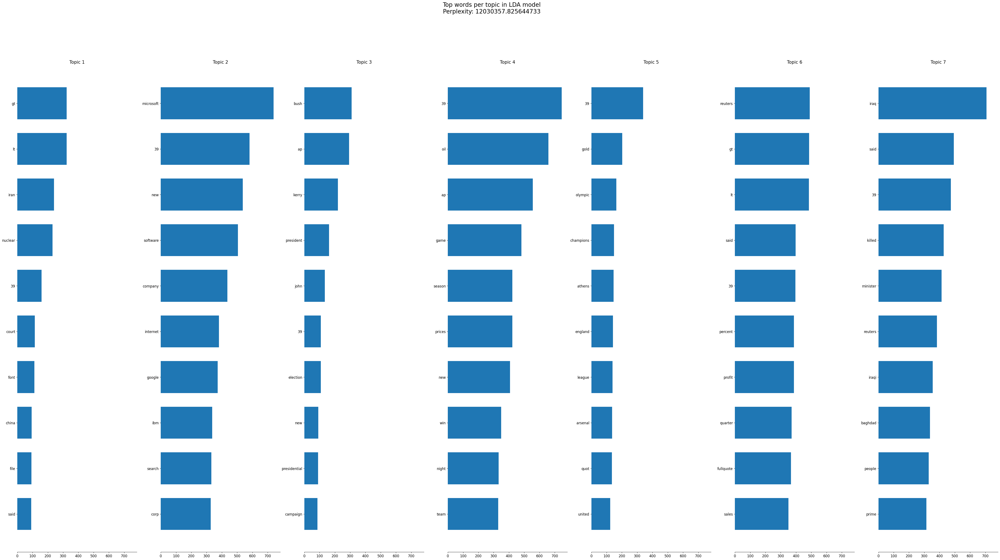

# Topic Modelling
Topic modelling-ul este o tehnica de analiza a textelor utilizata in inteligenta artificiala si procesarea limbajului natural (NLP) pentru a descoperi subiectele abstracte care apar intr-un set de documente. Aceasta ajuta la organizarea, intelegerea si rezumarea colectiilor mari de date textuale prin identificarea tiparelor tematice.
## Date de intrare
Ca date de antrenare/evaluare vom folosi c
## Metoda de lucru (LDA - Latent Dirichlet Allocation)
Latent Dirichlet Allocation (LDA) este o tehnica de analiza a textelor care identifica subiectele principale dintr-o colectie de documente. Functioneaza prin presupunerea ca fiecare document este compus dintr-un amestec de subiecte si fiecare subiect este compus dintr-un amestec de cuvinte. LDA utilizeaza modele probabilistice pentru a determina aceste subiecte, facilitand organizarea si intelegerea textelor mari.
## Metrica de evaluare (Perplexity)
Perplexity este o metrica folosita pentru a evalua cat de bine un model probabilistic prezice un set de date. In contextul topic modelling-ului, perplexity masoara cat de bine modelul generat de LDA se potriveste cu datele textuale.
## Rezultate
